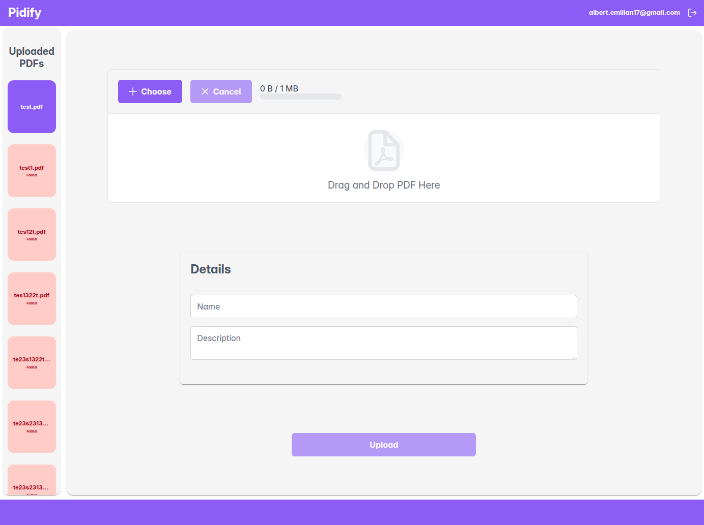
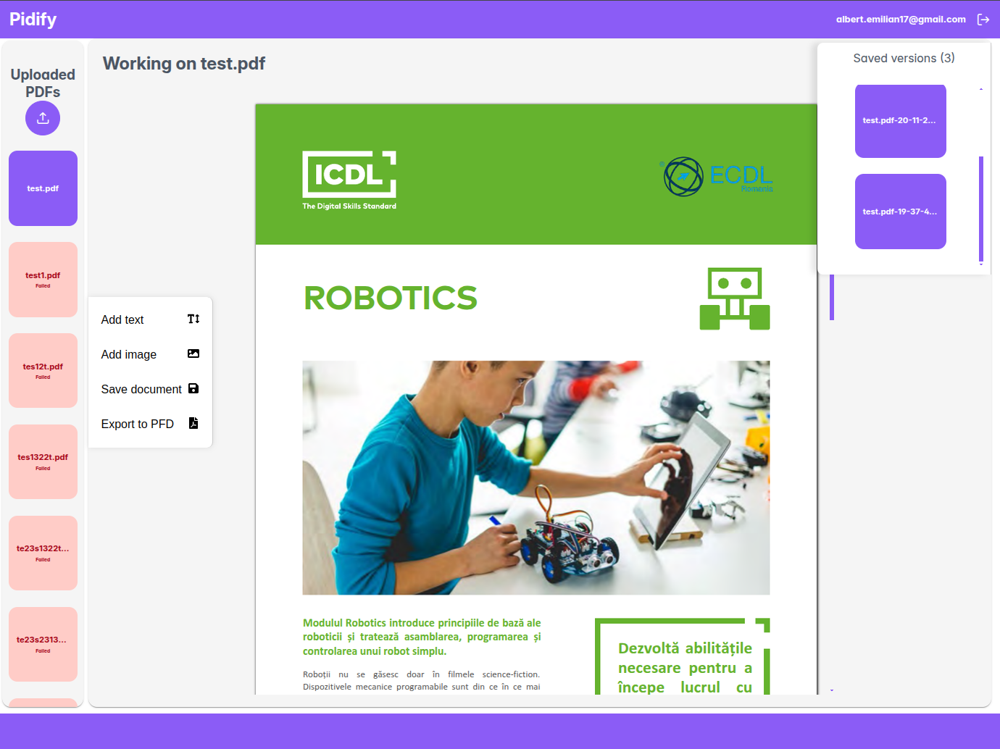
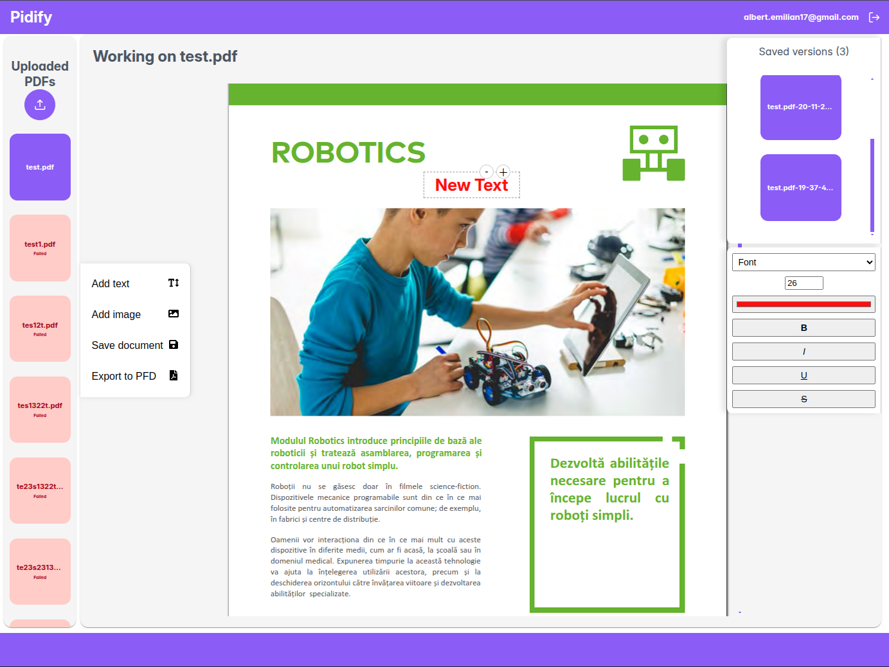
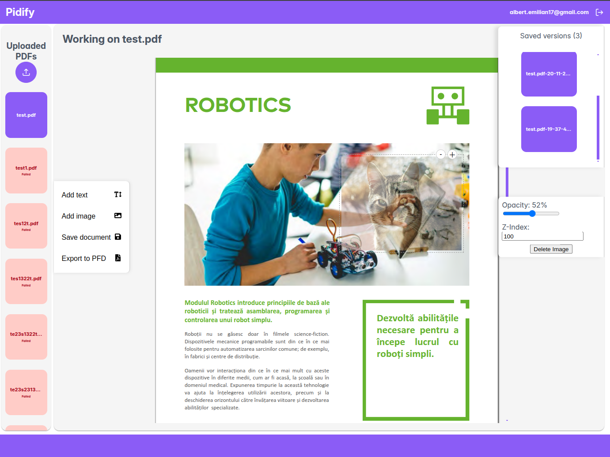

# Pidify 🧑‍💻

**Pidify is an web application that enabled the user to edit PDF files from text content to images and then exporting the result back to PDF.**

---


## Technologies

* **MongoDB**
* **Express.js**
* **React**
* **Python**

## Tools

* **Pdf2HTMLex**
* **OpenCV**
* **PDFCpu**
* **FFMpeg**
* **BullMQ**

---

## How to Run the Application

**You need NodeJS version 21 or higher**

1.  **Clone the repository:**
    ```bash
    git clone [https://github.com/mango-exe/pidify-mern](https://github.com/mango-exe/pidify-mern)
    cd pidify-mern
    ```
2.  **Install dependencies:**
    ```bash
    npm install
    ```
3.  **Setup Environment Variables:**
    Create a file named **`.env`** in the root of the repository and add the following keys. You must replace the placeholder values with your actual API keys and secrets.

    ```bash
    MONGODB_CONNECTION_STRING=mongodb://localhost:27017
    GOOGLE_CLIENT_ID=
    GOOGLE_CLIENT_SECRET=
    OAUTH_FRONTEND_REDIRECT_URL=http://localhost:3000
    EXPRESS_SESSION_SECRET='secret'
    SERVER=http://localhost:8080
    ```

4.  **Create the MySQL data directory:**
    ```bash
    mkdir data
    ```
5.  **Build the Dockerfile for the database:**
    ```bash
    docker build -t pidify-mysql .
    ```
6.  **Run the MySQL Docker container:**
    ```bash
    docker run -d \
      --name pidify-mysql \
      -p 3306:3306 \
      -v $(pwd)/data:/var/lib/mysql \
      pidify-mysql
    ```
10. **Run the application:**
    ```bash
    npm run dev
    ```

The application should now be running locally, typically accessible at `http://localhost:3000`.

---

## Features Showcase

### Upload PDF interface


### PDF Editor interface


#### Adding new text to the PDF


#### Adding new image to the PDF


#### Editing existing text


---
